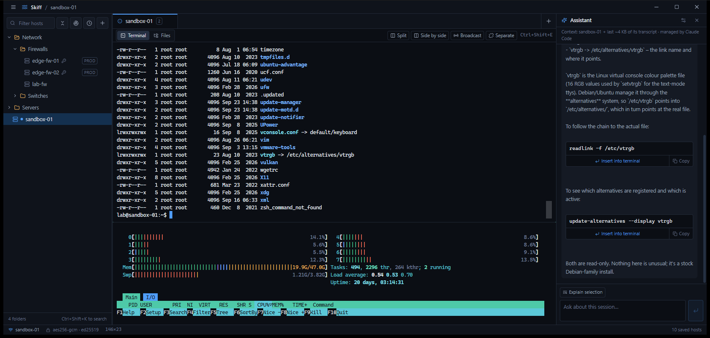
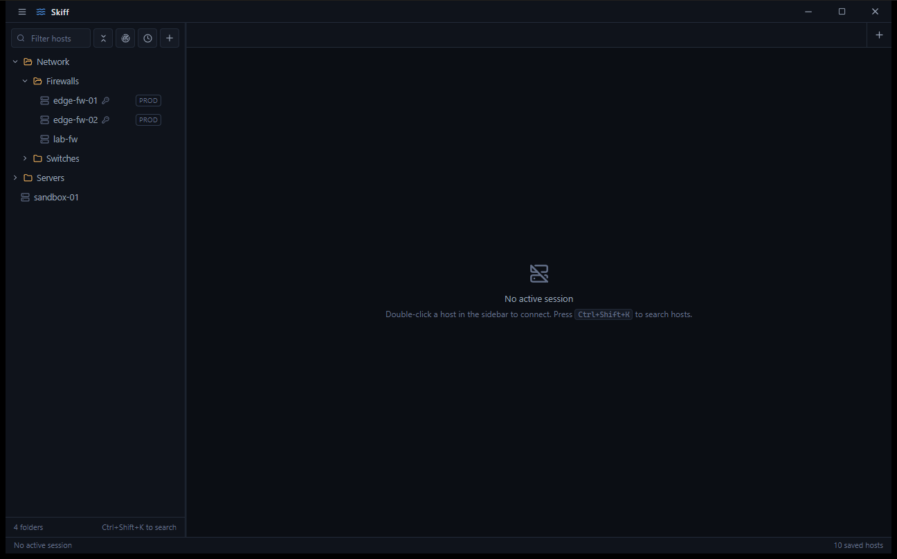
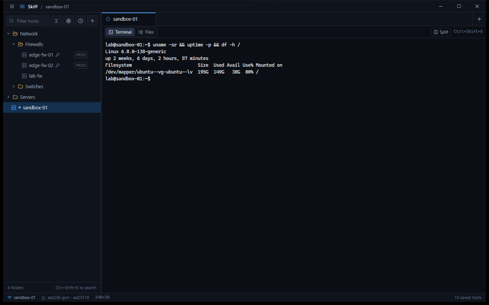
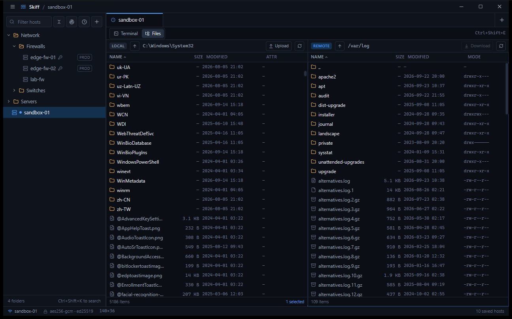
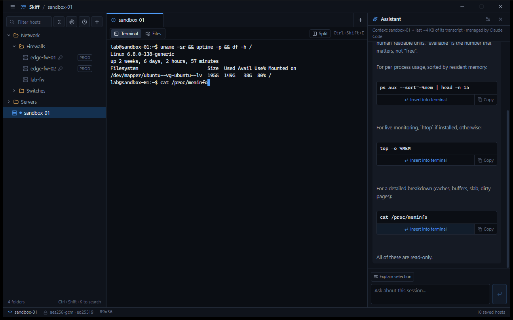

# Skiff

A fast, small SSH terminal and SFTP client for Windows, built for network and
systems administrators. Tauri + React front end, Rust back end — a single
**~6.5 MB** executable that idles around ~30 MB of memory, versus the
150–200 MB an Electron equivalent would use.

> Built by an infrastructure admin who spends the day in Palo Alto firewalls,
> ESXi hosts, switches, and Linux boxes — and wanted one tool that treats
> network appliances as first-class citizens, with the terminal front and
> center and the extra tooling one keystroke away.

Skiff is a PuTTY/Termius-class client first; the network toolbox, config
history, and AI assistant are there when you need them and out of the way when
you don't.

---

## Screenshots



| | |
|---|---|
|  |  |
|  |  |

---

## Features

### Terminal
- **xterm.js with WebGL rendering** and 10,000 lines of scrollback that
  **survive tab switches** — panes stay mounted, so nothing is lost when you
  move between sessions.
- **Split panes**, side by side or stacked, freely resizable by dragging the
  divider. Watch a log in one pane while you work in another.
- **Broadcast mode** — type once and it goes to every pane in the tab. Run the
  same `show` or config line across several devices at once (the toggle turns
  amber while live, because that's a loaded gun on production gear).
- **Right-click paste** (PuTTY-style, with copy-on-select) and
  **`Ctrl+Shift+F` find** in the scrollback.
- **Per-host snippets** bound to `Ctrl+Shift+1`–`9` — your frequent commands
  for *this* device, one keystroke away, with an optional "run immediately" flag.
- **On-connect command presets**: tmux/screen keep-alive, PAN-OS terminal width
  and pager-off, Cisco paging-off — applied automatically when you connect.

### Connections & authentication
- **Password, private key, SSH agent, and keyboard-interactive** auth. The
  keyboard-interactive fallback is what makes **TACACS+-fronted network gear**
  work, where the device advertises only that method and asks a hidden
  "Password:".
- **Generate a key in-app and install it in one click** — Skiff creates an
  Ed25519 keypair and, with the password entered once, appends it to the
  server's `authorized_keys` itself (an `ssh-copy-id` built in). No copy/paste
  ritual.
- **SSH agent** support — Windows OpenSSH agent (named pipe) and PuTTY's
  Pageant; keys never leave the agent.
- **ProxyJump** through any saved host, so you reach segmented networks through
  a bastion.
- **Port forwarding** — local (`-L`) and **SOCKS5 dynamic (`-D`)**, bound to
  127.0.0.1 only, managed per session. Point a browser at the SOCKS proxy to
  reach a device's web UI on an isolated management VLAN.
- **Keepalives** detect a dropped link in about 45 seconds; a **one-click
  Reconnect** brings the tab back.
- **Quick connect** (`Ctrl+Shift+P`) for a one-off box — `user@host:port`,
  optional one-shot password, nothing saved.

### File transfer (SFTP)
- **Dual-pane browser** — local on the left, remote on the right.
- **Drag and drop** between the panes to transfer, or from Windows Explorer to
  upload. **Recursive** — whole directory trees, with byte-accurate progress.
- **Right-click any file** for Upload/Download, Rename, New folder, Properties,
  and Delete.
- **Overwrite guard** — a transfer that would clobber an existing file stops and
  asks first.
- The **transfer queue keeps running and visible** even when you switch back to
  the terminal.

### Network troubleshooting
- Built-in **ping, traceroute** (live-streamed), **TCP port check** that
  distinguishes open / closed / filtered, and **DNS lookup** — run from your
  workstation, for exactly the moment SSH *can't* connect.
- **Reachability sweep**: one click probes every saved host's SSH port and marks
  the sidebar. On demand only — Skiff never background-scans your network.

### Config management
- **Config snapshots** — set a capture command per host (`show running-config`,
  `show config running`, `cat /etc/…`); Skiff runs it over a hidden channel,
  stores timestamped plain-text history, and **diffs any two snapshots**. The
  answer to "what changed on this box since Tuesday," in two clicks.

### AI assistant *(optional, advisor-only)*
- A side panel (`Ctrl+Shift+A`) that sees your session and **suggests** — "how
  do I monitor CPU here?" gets a `htop` chip you can insert. **It cannot run
  anything**: suggestions are typed onto your prompt with no newline, and *you*
  press Enter. That final keystroke is the entire approval model.
- **Bring your own provider**: Anthropic API, any OpenAI-compatible endpoint,
  **Ollama** or **LM Studio** locally (nothing leaves the machine), or the
  **Claude Code CLI** using your existing Claude subscription.
- **Privacy by construction**: AI is **off by default for red-accented
  (production) hosts**; a **pre-send secret guard** scans the context and pauses
  with a warning if it looks like a password is about to be sent; local
  providers send nothing off-machine at all.

### Operator safety
- **Host keys**: trust-on-first-use with a SHA256 fingerprint prompt. A
  **changed** key is refused outright — never a click-through, because that's
  the one case that's genuinely an attack.
- **Per-host accent colors** — make production *look* different (red frame)
  before you type into the wrong window.
- **Session transcripts**, ANSI-stripped and flushed per chunk (so they survive
  a crash), with an **in-app history browser** and automatic retention
  (30 days / 500 files). On reconnect, the tail replays so you see where you
  left off — the only continuity available on appliances that keep none.
- **Colorblind-safe**: connection status is carried by glyph *shape* first, hue
  second.

---

## Security model

Skiff handles credentials for infrastructure, so the boundaries are deliberate:

- **Secrets live in Windows Credential Manager**, encrypted per-user by DPAPI —
  never in config files, never in plaintext on disk.
- **No IPC command ever returns a secret to the UI.** The front end only passes
  a host id; the password is resolved in Rust and used there. There is no
  "read password" command to abuse.
- **`hosts.json` is topology only** — names, addresses, ports, folders — so it's
  safe to export and share. Passwords are structurally absent.
- **Restored tabs come back disconnected.** Opening the app never dials your
  infrastructure on its own.
- **TLS uses the OS trust store**, so a corporate SSL-inspection CA is honored;
  no verification is ever disabled.
- **Download path-traversal is blocked** — a malicious server can't use a
  crafted filename (`..\…`, absolute paths) to write outside the folder you
  chose.
- Minimal Tauri surface: no shell/filesystem/dialog plugins, a restrictive CSP,
  and the webview makes no cross-origin requests (AI calls run in Rust).

See [SECURITY.md](SECURITY.md) for the invariants a contributor must not break,
and how to report a vulnerability.

---

## Install

Grab the artifacts for your platform from the [Releases](../../releases) page.

**Windows**
- **`Skiff_<version>_x64-setup.exe`** — installer. Per-user, no admin prompt,
  Start Menu entry and uninstaller, and it auto-installs the WebView2 runtime if
  the machine lacks it. Recommended.
- **`skiff.exe`** — portable single file. Run from anywhere, delete to remove.
  Assumes WebView2 is present (it ships with Windows 10/11).

**Linux**
- **`.AppImage`** — universal, no install: `chmod +x Skiff_*.AppImage && ./Skiff_*.AppImage`
  on any recent distro.
- **`.deb`** — Debian/Ubuntu: `sudo apt install ./skiff_<version>_amd64.deb`.

  Secrets are stored in the freedesktop Secret Service (GNOME Keyring / KWallet),
  and the SSH agent is read from `$SSH_AUTH_SOCK`.

> Windows builds are not code-signed yet, so SmartScreen may warn on first run —
> choose **More info → Run anyway**. (Signing is on the roadmap.)

## Build from source

Prerequisites: Node 20+, Rust (MSVC toolchain), and Visual Studio Build Tools
with the C++ workload.

```
npm install
npm run tauri build -- --no-bundle   # portable exe → src-tauri/target/release/skiff.exe
npm run tauri build                  # installer   → …/release/bundle/nsis/
npm run tauri dev                    # hot reload + devtools
```

## Where Skiff keeps things

| Path | Contents |
|---|---|
| `%APPDATA%\skiff\hosts.json` | Host catalogue (no secrets) |
| `%APPDATA%\skiff\known_hosts` | Trusted host keys (OpenSSH format) |
| `%APPDATA%\skiff\sessions.json` | Tabs to restore on launch |
| `%APPDATA%\skiff\configs\<host>\` | Config snapshots |
| `%APPDATA%\skiff\logs\` | Session transcripts (**plaintext — treat as sensitive**) |
| Windows Credential Manager | Passwords / key passphrases (`skiff:host:<id>`) |

## Keyboard shortcuts

| Shortcut | Action |
|---|---|
| `Ctrl+Shift+K` | Focus host search |
| `Ctrl+Shift+P` | Quick connect |
| `Ctrl+Shift+A` | AI assistant panel |
| `Ctrl+Shift+F` | Find in terminal |
| `Ctrl+Shift+E` | Toggle terminal / files |
| `Ctrl+Shift+W` | Close tab |
| `Ctrl+Shift+1`–`9` | Send that host's snippet |
| `Ctrl+Tab` | Cycle tabs |
| `Ctrl+Shift+C/V` | Copy / paste (right-click also pastes) |

## Roadmap & limitations

Planned work and the reasoning behind deliberately *rejected* features are in
[ROADMAP.md](ROADMAP.md). Current limitations:

- **macOS** is not built yet — the code is cross-platform (Keychain and
  `$SSH_AUTH_SOCK` agent support are in place), it just needs a signed and
  notarised build. **Windows and Linux ship today.**
- **Remote forwarding (`-R`)** is not implemented yet; `-L` and `-D` are.
- **Transcripts are lossy for full-screen programs** (vim, top) — inherent to
  flattening a live terminal into a text log.
- **PuTTY `.ppk` keys** must be exported to OpenSSH format first.

## Built with

[Tauri 2](https://tauri.app), [React](https://react.dev),
[Tailwind CSS](https://tailwindcss.com), and [russh](https://github.com/Eugeny/russh)
— a pure-Rust SSH implementation, so there's no OpenSSL/libssh2 system
dependency.

## License

MIT — see [LICENSE](LICENSE).
